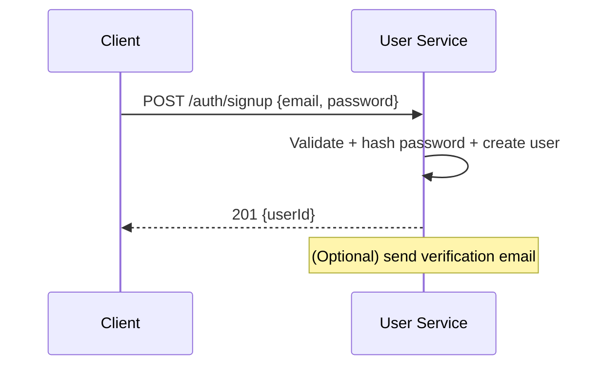
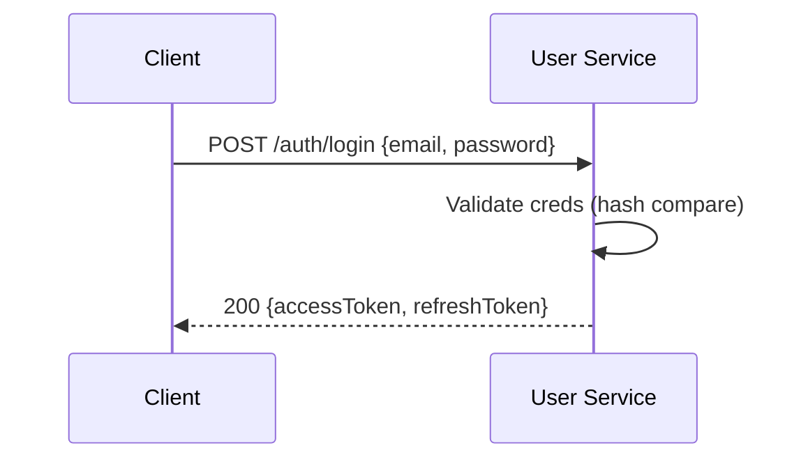
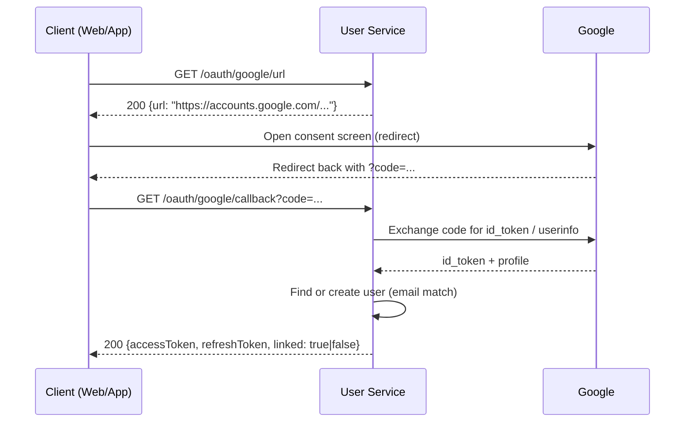
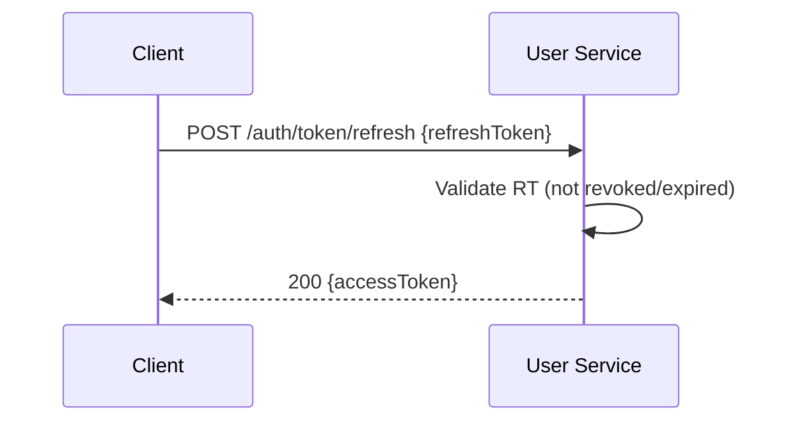
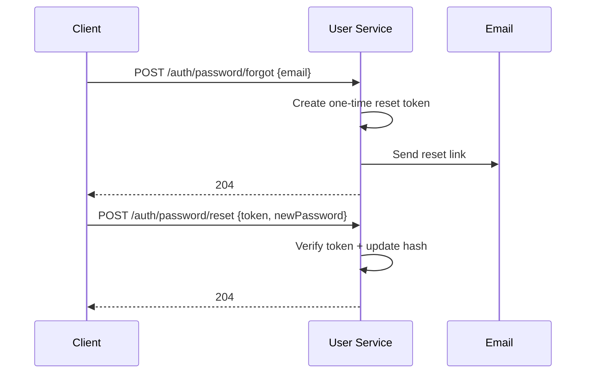

# User Service — Email/Password + Google OAuth
Minimal, production-ready spec combining **Features**, **Flows**, and **API Endpoints**.

---

## 1) Features (Minimal)
- **Email/Password**
  - Sign up (store email + hashed password)
  - Sign in (validate credentials → access & refresh tokens)
  - Password reset (email link + one-time token)
  - Change password (old → new)
- **Google OAuth**
  - Sign in with Google (verify ID/Code with Google)
  - Link/unlink Google to existing account
- **Account**
  - Get/Update profile (name, avatar, phone)
  - Logout (current session) & Logout-all (revoke all refresh tokens)
- **Security**
  - Hash: bcrypt/Argon2
  - HTTPS required
  - JWT access token + refresh token
  - Rate limiting on auth endpoints
  - Temporary lock after multiple failed logins
  - CSRF protection (if using cookies/sessions in browser context)

---

## 2) Flows (Minimal)

### 2.1 Sign Up (Email/Password)


### 2.2 Sign In (Email/Password)


### 2.3 Google OAuth (Authorization Code)


### 2.4 Refresh Access Token


### 2.5 Password Reset


---

## 3) API Specification (Minimal)

> **Base URL:** `/api`  
> **Auth:** `Authorization: Bearer <accessToken>` (except login/signup/forgot/reset/refresh)

### 3.1 Email/Password
#### POST `/auth/signup`
- **Body**: `{"email":"a@b.com","password":"secret123"}`
- **201** → `{"userId":"u_123"}`
- **409** if email exists · **400** invalid input

#### POST `/auth/login`
- **Body**: `{"email":"a@b.com","password":"secret123"}`
- **200** → `{"accessToken":"JWT","refreshToken":"RT"}`
- **401** invalid credentials · **423** locked

#### POST `/auth/password/forgot`
- **Body**: `{"email":"a@b.com"}`
- **204** (always)  
- (Do not leak account existence)

#### POST `/auth/password/reset`
- **Body**: `{"token":"RESET_TOKEN","newPassword":"NewP@ssw0rd"}`
- **204** · **400/410** invalid/expired token

#### POST `/auth/password/change`
- **Auth**: Bearer
- **Body**: `{"oldPassword":"old","newPassword":"new"}`
- **204** · **401/400**

### 3.2 Google OAuth
#### GET `/oauth/google/url`
- **200** → `{"url":"https://accounts.google.com/o/oauth2/v2/auth?..."}`
  - Includes: `client_id`, `redirect_uri`, `scope`, `state`, `code_challenge` (PKCE), etc.

#### GET `/oauth/google/callback?code=...&state=...`
- **200** → `{"accessToken":"JWT","refreshToken":"RT","linked":true|false}`
- **400/401** invalid code/state

#### POST `/oauth/google/link`
- **Auth**: Bearer
- **Body**:
  - If using **ID token** from Google Sign-In: `{"idToken":"<google_id_token>"}`
  - Or using **Auth Code**: `{"code":"<google_code>"}`
- **200** → `{"linked":true}`
- **409** email linked to another user

### 3.3 Account
#### GET `/users/me`
- **Auth**: Bearer
- **200** → `{"id":"u_123","email":"a@b.com","name":"Alice","avatar":"..."}`

#### PATCH `/users/me`
- **Auth**: Bearer
- **Body** (partial): `{"name":"Alice","avatar":"https://...","phone":"+8412345"}`
- **200** → updated profile

#### POST `/auth/logout`
- **Auth**: Bearer
- **Body**: `{"refreshToken":"RT"}`
- **204**

#### POST `/auth/logout-all`
- **Auth**: Bearer
- **204**

### 3.4 Token
#### POST `/auth/token/refresh`
- **Body**: `{"refreshToken":"RT"}`
- **200** → `{"accessToken":"JWT"}`
- **401/400** invalid/expired/revoked

### 3.5 Internal (Service-to-Service)
> Use signed service JWT or mTLS; **never** user access tokens here unless explicitly verified.

#### POST `/internal/auth/verify`
- **Body**: `{"accessToken":"JWT"}`
- **200** → `{"active":true,"sub":"u_123","email":"a@b.com","scopes":["user:read"]}`
- **200** → `{"active":false}` when invalid/expired
- **401** if caller not authorized

#### GET `/internal/users/:id`
- **200** → `{"id":"u_123","email":"a@b.com","status":"active"}`

#### GET `/internal/users/by-email/:email`
- **200** → `{"id":"u_123","email":"a@b.com"}`
- **404** if not found

---

## 4) Common Status Codes
- **200** OK  
- **201** Created  
- **204** No Content  
- **400** Bad Request  
- **401** Unauthorized  
- **403** Forbidden  
- **404** Not Found  
- **409** Conflict  
- **410** Gone (expired token)  
- **423** Locked  
- **429** Too Many Requests  

---

## 5) Minimal JWT Claims (Access Token)
- `sub`: user id  
- `iat`: issued at  
- `exp`: expiry  
- `iss`: issuer  
- `aud`: audience  
- `scp`: optional scopes  

---

## 6) Example cURL

### Login
```bash
curl -X POST https://example.com/api/auth/login   -H "Content-Type: application/json"   -d '{"email":"a@b.com","password":"secret123"}'
```

### Get Profile
```bash
curl https://example.com/api/users/me   -H "Authorization: Bearer <accessToken>"
```

### Verify (service-to-service)
```bash
curl -X POST https://example.com/api/internal/auth/verify   -H "Authorization: Bearer <serviceToken>"   -H "Content-Type: application/json"   -d '{"accessToken":"<JWT>"}'
```
